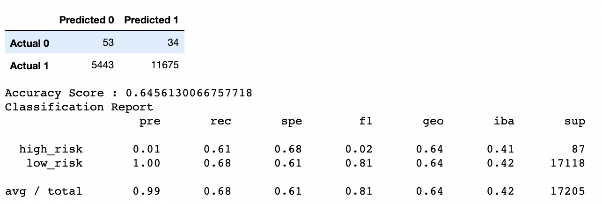
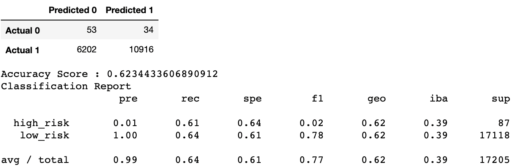
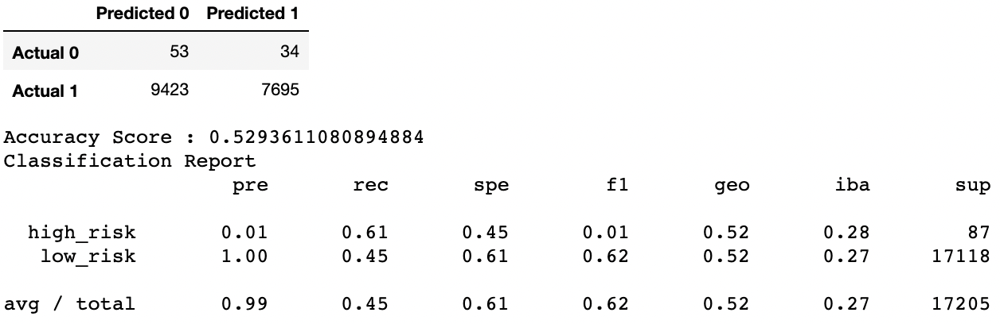
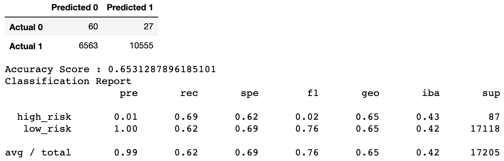
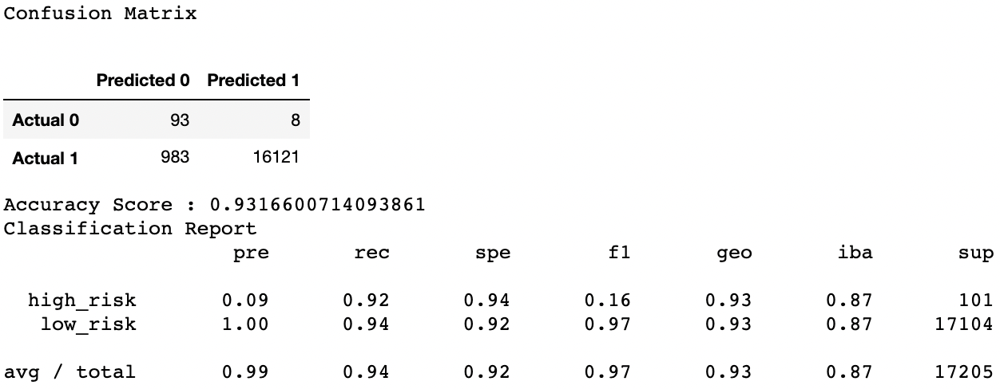

# Credit Risk Analysis

## Overview of Analysis 

In this analysis, I use Machine Learning to predict the credit risk of candidates seeking loans. I test several Machine Learning models to maintain a model that predicts with high accuracy according to the classification report. After preprocessing the data, using the train_test_split function of Python I split the dataset into a train and test dataset. I then use four resampling techniques and two ensemble algorithms to test the model.

## Results 

### Resampling Models to Predict Credit Risk 

Since I am trying to identify good candidates for loans I am going to assume that as a bank we prefer finding a good candidate over one that would default and don't mind losing customers for this reason. So throughout my analysis, I will consider the recall score as more important.

#### Oversampling 

**1. RandomOverSampler** 

- Accuracy Score: 65% 
- Precision Score: 99% 
- Recall Score: 68%

***Table 1: Analysis using RandomOverSampler***

**2. SMOTE Oversampling** 

- Accuracy Score: 62% 
- Precision Score: 99% 
- Recall Score: 64%

***Table 2: Analysis using SMOTE***

#### Undersampling 

**1. ClusterCentroids** 

- Accuracy Score: 53% 
- Precision Score: 99% 
- Recall Score: 45%

***Table 3: Analysis using ClusterCentroids***

#### SMOTEENN Algorithm to Predict Credit Risk 

- Accuracy Score: 65% 
- Precision Score: 99% 
- Recall Score: 62%

***Table 4: Analysis using SMOTEENN***

### Ensemble Classifiers to Predict Credit Risk 

**1. BalancedRandomForestClassifier** 

- Accuracy Score: 79% 
- Precision Score: 99% 
- Recall Score: 87%

***Table 5: Analysis using BalancedRandomForestClassifier***

**2. EasyEnsembleClassifier** 

- Accuracy Score: 93% 
- Precision Score: 99% 
- Recall Score: 94%

***Table 6: Analysis using EasyEnsembleClassifier***

## Summary

For this analysis the recall metric is more important than the precsion metric. Compared to the ensemble classifiers to predict credit risk, the resampling models don't produce a perfect model fit. According to all the models the results of the EasyEnsembleClassifier reflect a high accuracy and a high recall value. I would recommend using this model.

#The end.
#By Deja